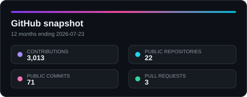
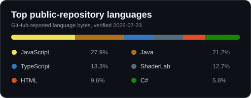

<h1 align="center">Pesanth Janaseth</h1>

  Software engineer · AI-assisted development · Halifax, Canada

  Full-stack engineer with 2+ years of experience delivering financial applications, 
  cloud pipelines, and REST APIs, including AI-assisted development with proven productivity improvements.

  
  
  
  

  Open to software engineering roles in Canada.

## Selected projects.

Flagship full-stack systems, cloud backend services, and AI reliability tooling. Every project below has a technical overview covering its purpose, architecture, engineering decisions, verification evidence, and limitations.

### Sentinel

A streaming telemetry platform that collects readings from two self-hosted machines every ten seconds, moves them through Kafka, and archives them in day-partitioned HDFS storage that a public dashboard reads back. Collectors buffer to local disk when the broker is unreachable and replay in order once it returns, and stream offsets are committed only after each batch reaches storage.

### arXiv Daily Digest

A scheduled pipeline that reads the day's new AI papers on arXiv, selects three, and summarizes each from the body of the paper rather than its abstract. Two automated checks stand between the model and the page: the quoted fragment must appear in the paper, and every figure written must appear in it too. A summary that fails either check is published marked unverified rather than presented as checked.

### Car Sale Application

A React and Spring Boot peer-to-peer car marketplace with JWT authentication, role-based access, MySQL persistence, and Docker packaging. Live at [carsale.pesanth.com](https://carsale.pesanth.com), self-hosted on a Linux server behind an outbound-only Cloudflare Tunnel. Sign in as `demo` / `demo1234` to browse the market, list a vehicle, and buy from another seller.

### Cube Store

A full-stack Angular and Express commerce platform with MongoDB, Stripe Checkout, responsive product discovery, cart workflows, and Docker packaging. Live at [cubestore.pesanth.com](https://cubestore.pesanth.com), self-hosted behind the same tunnel. The public demo is deliberately read-only: browse, search, and filter all 66 products, with checkout disabled.

### Incident Triage Assistant

A retrieval-augmented incident-triage workflow with a dependency-free BM25 index, structured Claude outputs, a CLI, a Streamlit interface, and an offline evaluation suite.

### WinGet App Installer

A Windows desktop utility for discovering, selecting, and bulk-installing WinGet packages through a guided interface, with automated release builds and downloadable binaries.

## Production work with measurable outcomes.

- Delivered 39+ Azure CI/CD pipelines using Ansible and Docker.
- Resolved 50+ production incidents through log analysis, diagnosis, and root-cause investigation.
- Built customer-facing financial dashboards across 24+ components.

## Capabilities.

**Core languages and application development**

**Cloud, delivery, and reliability**

## GitHub activity.

  
  

Verified through GitHub on 2026-07-23. Contribution totals use GitHub's twelve-month contribution calendar; language percentages use GitHub-reported bytes across owned public repositories.

## Explore the architecture.

Every featured project has a recruiter-friendly technical overview covering its purpose, use cases, top-down architecture, engineering decisions, verification evidence, and limitations.

