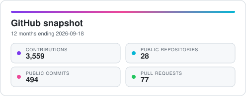
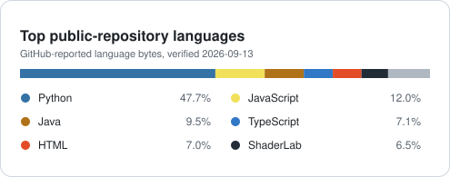
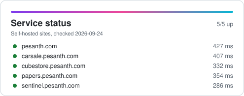

<h1 align="center">Pesanth Janaseth Rangaswamy Anitha</h1>

  Software engineer · Halifax, Canada

  Full-stack engineer with 2+ years building financial dashboards, Azure CI/CD pipelines, and REST APIs.

  
  
  
  

  Open to software engineering roles in Canada.

## Capabilities

**Core languages and application development**

**Cloud, delivery, and reliability**

## Activity

  <picture>
    <source media="(prefers-color-scheme: dark)" srcset="./assets/github-stats-dark.svg" />
    
  </picture>
  <picture>
    <source media="(prefers-color-scheme: dark)" srcset="./assets/top-languages-dark.svg" />
    
  </picture>

  <picture>
    <source media="(prefers-color-scheme: dark)" srcset="./assets/status-dark.svg" />
    
  </picture>

GitHub figures rebuilt from the API each morning; live sites pinged from the Actions runner at the same time.

## Explore the architecture

Every project has a technical overview of its architecture and design decisions.

